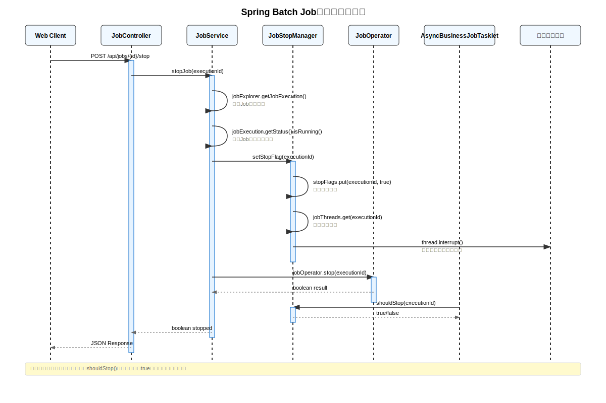

# Spring Batch Job停止机制核心实现分析

## 概述

本文档详细分析了Spring Batch项目中Job停止功能的核心实现机制，包括时序图和关键代码分析。

## 核心组件

### 1. JobController - Web接口层
```java
@PostMapping("/api/jobs/{executionId}/stop")
public ResponseEntity<Map<String, Object>> stopJob(@PathVariable Long executionId) {
    boolean stopped = jobService.stopJob(executionId);
    // 返回停止结果
}
```

### 2. JobService - 业务逻辑层
```java
public boolean stopJob(Long executionId) {
    // 1. 检查Job是否存在
    JobExecution jobExecution = jobExplorer.getJobExecution(executionId);
    
    // 2. 检查Job是否正在运行
    if (!jobExecution.getStatus().isRunning()) {
        return true;
    }
    
    // 3. 设置停止标志
    jobStopManager.setStopFlag(executionId);
    
    // 4. 调用Spring Batch停止方法
    boolean stopped = jobOperator.stop(executionId);
    
    return true; // 总是返回true，因为停止标志已设置
}
```

### 3. JobStopManager - 停止状态管理器
```java
@Component
public class JobStopManager {
    // 停止标志存储
    private final ConcurrentHashMap<Long, AtomicBoolean> stopFlags = new ConcurrentHashMap<>();
    // 线程引用存储
    private final ConcurrentHashMap<Long, Thread> jobThreads = new ConcurrentHashMap<>();
    
    public void setStopFlag(Long executionId) {
        stopFlags.put(executionId, new AtomicBoolean(true));
        
        // 强制中断对应线程
        Thread jobThread = jobThreads.get(executionId);
        if (jobThread != null && jobThread.isAlive()) {
            jobThread.interrupt();
        }
    }
    
    public boolean shouldStop(Long executionId) {
        AtomicBoolean stopFlag = stopFlags.get(executionId);
        return stopFlag != null && stopFlag.get();
    }
}
```

### 4. AsyncBusinessJobTasklet - 业务处理层
```java
@Async("taskExecutor")
public CompletableFuture<Void> executeBusinessLogicAsync(String batchId, Long batchExecutionId, Long jobExecutionId) {
    try {
        // 注册当前线程
        jobStopManager.registerJobThread(jobExecutionId, Thread.currentThread());
        
        // 业务处理循环
        for (Task task : unprocessedTasks) {
            // 检查停止标志
            if (jobStopManager.shouldStop(jobExecutionId)) {
                logger.info("検出到停止信号，退出処理ループ");
                break;
            }
            
            // 模拟长时间处理
            Thread.sleep(batchProperties.getSimulationDurationSeconds() * 1000);
            
            // 处理任务...
        }
    } finally {
        // 清理停止标志和线程引用
        jobStopManager.clearStopFlag(jobExecutionId);
    }
}
```

## 停止机制设计特点

### 1. 双重停止机制
- **Spring Batch原生停止**: 通过`JobOperator.stop()`
- **自定义停止标志**: 通过`JobStopManager`管理停止状态

### 2. 线程安全设计
- 使用`ConcurrentHashMap`存储停止标志
- 使用`AtomicBoolean`确保标志操作的原子性
- 线程中断机制确保及时响应停止请求

### 3. 优雅停止策略
- 业务处理循环中定期检查停止标志
- 支持当前任务完成后再停止
- 资源清理机制确保无内存泄漏

### 4. 强制停止机制
- 线程中断作为备用停止手段
- 处理长时间阻塞的业务逻辑
- 确保系统响应性

## 时序图说明



### 关键步骤解析：

1. **Web请求**: 客户端发送停止请求到JobController
2. **参数验证**: JobService检查Job是否存在和运行状态
3. **设置停止标志**: JobStopManager设置停止标志并中断线程
4. **Spring Batch停止**: 调用原生停止方法
5. **业务逻辑响应**: AsyncBusinessJobTasklet检查停止标志并退出
6. **资源清理**: 清理停止标志和线程引用
7. **结果返回**: 返回停止操作结果给客户端

## 核心优势

### 1. 可靠性
- 多层次停止机制确保Job能够被成功停止
- 异常处理机制保证系统稳定性

### 2. 响应性
- 线程中断机制确保快速响应停止请求
- 定期检查机制避免长时间等待

### 3. 安全性
- 线程安全的状态管理
- 资源清理机制防止内存泄漏

### 4. 扩展性
- 支持多Job并发执行和独立停止
- 可扩展的停止策略设计

## 使用场景

1. **长时间运行的批处理任务**
2. **需要及时响应停止请求的业务场景**
3. **多任务并发处理环境**
4. **资源敏感的生产环境**

## 最佳实践

1. **定期检查停止标志**: 在业务处理循环中定期调用`shouldStop()`
2. **合理设置检查间隔**: 平衡响应性和性能
3. **完善异常处理**: 确保异常情况下也能正确清理资源
4. **监控和日志**: 记录停止操作的详细信息便于调试

## 总结

该停止机制设计体现了企业级应用的高标准要求，通过多层次的停止策略、线程安全的状态管理和完善的资源清理机制，确保了批处理系统的可靠性和稳定性。这种设计模式可以作为其他类似系统的参考实现。